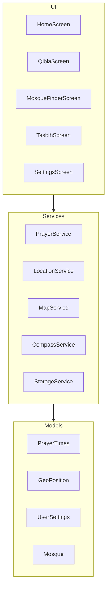
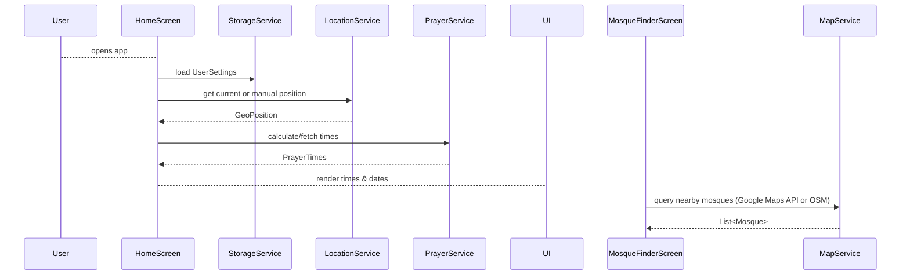

# Architecture Document for "Muslim Deen" App

## 1. Tech Stack
- Framework: Flutter (Dart)
- State Management: Riverpod or Provider
- Local Storage: SQLite (sqflite) or Hive
- HTTP & JSON: dio or http
- Date/Time & Hijri Calendar:
  - adhan package (prayer calculus)
  - hijri or ummalqura_calendar
- Geolocation & Maps:
  - geolocator (GPS)
  - geocoding (reverse geocode)
  - google_maps_flutter or flutter_map + OSM
- Sensors: flutter_compass (Qibla)
- Localization: flutter_localizations + intl
- Theming & UI: Material Design 3

## 2. Modular Feature Breakdown



## 3. Folder Structure

```mermaid
flowchart LR
  lib
  ├── main.dart
  ├── models
  │   └── *.dart
  ├── services
  │   └── *.dart
  ├── providers
  │   └── *.dart
  ├── screens
  │   ├── home_screen.dart
  │   ├── qibla_screen.dart
  │   ├── mosque_finder_screen.dart
  │   ├── tasbih_screen.dart
  │   └── settings_screen.dart
  ├── widgets
  │   └── shared_widgets.dart
  └── utils
      └── date_utils.dart
```

## 4. Data Flow & External APIs



- Prayer Times:
  - Local Calculation: adhan package
  - Fallback API: AlAdhan (`api.aladhan.com`)
- Map & Geocode:
  - Google Maps SDK/REST or OSM Nominatim
- Qibla: Local compass + geolocation

## 5. Wireframes & Layout

### Home Screen
- AppBar: Gregorian & Hijri dates
- Body:
  - Vertical list of prayer times (Fajr to Isha)
  - Next-prayer countdown
  - Location display + Refresh button

### Qibla Screen
- Full-screen compass widget
- Numeric bearing display

### Nearest Mosque Finder
- Full-screen map with markers
- Tap marker to show name & distance

### Tasbih Counter
- Large counter display
- “+” and “Reset” buttons

### Settings
- ListTiles:
  - Location (manual input)
  - Calculation method (dropdown)
  - Language (dropdown)
  - Date/time format (toggle)
  - About (version & credits)

---